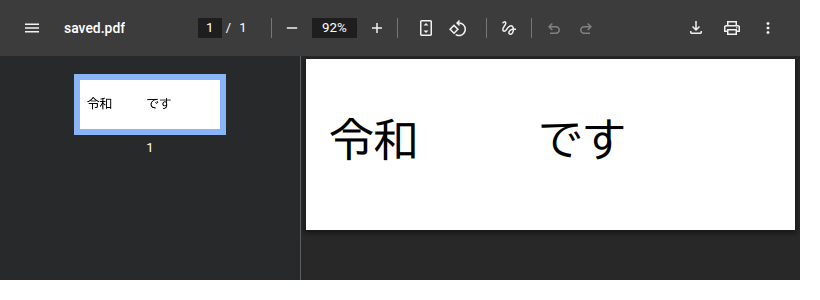
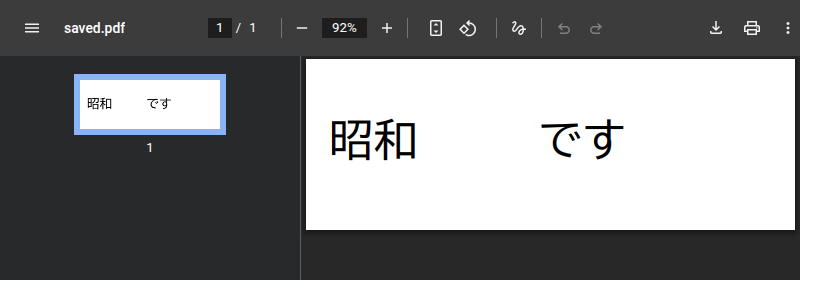

# 実験: 既存fontに無い日本語文字を、fontを埋め込んで書けるか

**判定: Go**（範囲を限定した上で成立）

これは正式機能ではありません。engineのversionは上げておらず、公開APIも変更していません。
実装は `src/experimental/font-embedding.js` にあり、`src/index.js` からexportしておらず、
配布物 `dist/idontlovepdf-engine.js` にも含まれません。

---

## 1. 背景と、現在の制約

engineは置換文字を「そのPDFが既に使っているfontのCMapを逆引きして」書き込みます。
そのため**元PDFに一度も出てこない文字は書けません**。

| 置換 | 結果 |
| --- | --- |
| `令和 → 平成` | 成功（平・成が元PDFのfontに存在する場合） |
| `令和 → 昭和` | `FONT_ENCODING_UNSUPPORTED`（昭が存在しない） |
| `令和 → しょうわ` | 同上 |

実PDFのfontは通常subset化されており、`/ToUnicode` には**その文書が実際に使った文字だけ**が
載ります。したがってこの制約は例外ではなく通常状態です。

一般職員向けのPDF編集ツールとして見ると「その文書に既に出てくる文字にしか変更できない」
ことになり、実用性の観点で決定的です。そこで、
**新しい日本語fontをPDFへ埋め込み、置換部分だけそのfontで描画すれば解決するか**
を単独で検証しました。

annotation・overlay・白塗り再描画・画像化は使わず、これまでどおり
**ページのcontent streamを編集し、incremental updateとして保存する**方式を維持しています。

## 2. 検証範囲

font埋め込みだけを切り分けるため、意図的に次へ限定しました。

- 単一run
- run全体が一致（部分一致は対象外）
- 置換前後で同じ文字数
- 元fontのfont sizeを引き継ぐ

文字数変更・複数run・部分run・レイアウト再計算は**この実験の対象外**です。
該当する場合はエラーコードで明示的に拒否します(§9)。

## 3. 選定したfallback font

| 項目 | 値 |
| --- | --- |
| 正式名称 | BIZ UDGothic Regular |
| version | 1.05 |
| 配布元 | https://github.com/googlefonts/morisawa-biz-ud-gothic （tag `v1.05`） |
| license | SIL Open Font License 1.1（商用利用・再配布・埋め込み可） |
| ファイル | `fonts/ttf/BIZUDGothic-Regular.ttf` |
| サイズ | 4,667,376 bytes |
| SHA-256 | `709fcd41e3209fb765da750472f55ccdf925653e9fa7e1eb007cb65c8f749c75` |
| outline形式 | TrueType（glyf）→ PDFの `/FontFile2` に適合 |
| unitsPerEm | 2048 |
| glyph数 | 13,932 |

BIZ UD（Universal Design）系はMorisawaが日本の公共文書向けの可読性を意図して制作し、
Google FontsからOFLで公開しているものです。用途が今回の想定（自治体文書）と一致します。

Google Fonts配布分（`google/fonts` の `ofl/bizudgothic/BIZUDGothic-Regular.ttf`）と
upstream tag `v1.05` の内容が**バイト単位で同一**であることを確認済みです。

**取得方法**: `npm run poc:font` が上記の**tag固定URL**から取得し、SHA-256を照合して
`tmp/poc-fonts/`（git管理外）へ置きます。OFL.txtも同時に取得します。
4.5MBのバイナリはリポジトリ履歴に入れていません。
**engineは実行時に一切fetchしません**（fontのbytesは呼び出し側から渡します）。
fontが無い場合、関連testは失敗ではなくskipします。

## 4. font parser

**opentype.js 1.3.4**（MIT）。

- browser対応（ESM `dist/opentype.module.js`、esbuildでbundle可能）
- 実行時の外部通信なし
- 必要な機能（cmap → glyph ID、advance width、unitsPerEm、head/os2 metrics）を一通り持つ
- bundle増加量: 実験用bundleで **467,411 bytes**（engine単体 116,586 bytesとの差 ≒ 350KB、未minify）

TrueType parserの自作は行っていません。
なお**配布bundleには含めていません**（後述）。

## 5. PDFへ追加したfont object構造

glyph IDで直接addressするIdentity-H構成です。

```
Type0 (/Encoding /Identity-H)
 ├─ /DescendantFonts → CIDFontType2 (/CIDToGIDMap /Identity, /DW, /W)
 │                      └─ /FontDescriptor → /FontFile2（font全体、FlateDecode）
 └─ /ToUnicode → CMap（glyph ID → Unicode）
```

実際に生成されるobject（fixtureでの例）:

```
7  << /Type /Font /Subtype /Type0 /BaseFont /BIZUDGothic-Regular /Encoding /Identity-H
      /DescendantFonts [8 0 R] /ToUnicode 11 0 R >>
8  << /Type /Font /Subtype /CIDFontType2 /BaseFont /BIZUDGothic-Regular
      /CIDSystemInfo << /Registry (Adobe) /Ordering (Identity) /Supplement 0 >>
      /FontDescriptor 9 0 R /DW 1000 /W [3432 [1000] 5036 [1000]] /CIDToGIDMap /Identity >>
9  << /Type /FontDescriptor /FontName /BIZUDGothic-Regular /Flags 4
      /FontBBox [0 -120 1000 880] /ItalicAngle 0 /Ascent 880 /Descent -120
      /CapHeight 765 /StemV 80 /FontFile2 10 0 R >>
10 << /Length 3024898 /Length1 4667376 /Filter /FlateDecode >>   ← font本体
11 << /Length 351 >>                                             ← ToUnicode CMap
```

`/CIDToGIDMap /Identity` により **CID = glyph ID** となるため、
string operandにglyph IDをそのまま2byte big-endianで書けます。

### Unicode → glyph ID → CID

```
Unicode code point → (font cmap / opentype.js charToGlyph) → glyph ID → CID（= glyph ID）
```

glyph 0（.notdef）が返る文字は「fontに無い」として扱い、豆腐を描かずに拒否します。

### /ToUnicode

描画したglyphについて `<glyph ID> <UTF-16BE>` のbfcharを生成します。

```
<0D68> <662D>   ← glyph 3432 = 昭
<13AC> <548C>   ← glyph 5036 = 和
```

これによりreopen後もUnicodeとして検索でき、PDF Reader上でもコピー・検索の対象になります。
**表示できるがUnicodeを失う方式にはしていません。**

### /W（width）

fontのadvance widthを読み、PDFの1000 unit/em系へ正規化します
（`round(advance × 1000 / unitsPerEm)`）。
描画したglyphだけを `/W` に列挙し、それ以外は `/DW 1000` が担当します。
**width情報を正しく持つところまでで、後続文字位置の再計算は行っていません**（対象外）。

## 6. Page Resourcesへの追加

対象ページの `/Resources /Font` へ追加します。既存resourceは変更しません。

```
変更前: /Resources << /Font << /FJP 5 0 R >> >>
変更後: /Resources << /Font << /FJP 5 0 R /ILPFallback 7 0 R >> >>
```

`/Font` が間接参照（`/Font 12 0 R`）の場合は、その参照先objectを更新します。
`/Font` が無いページには `/Font` ごと追加します。

**名前衝突回避**: `/Font` dictionary内の既存名を読み、未使用の名前を選びます
（`ILPFallback` が使われていれば `ILPFallback1`, `ILPFallback2` …）。

## 7. content streamでのfont切替と復帰

scannerに内部metadataとして `fontSize`（`Tf` のsize）と `operatorEnd`
（text-showing operatorの終端byte offset）を追加し、`<operand> Tj` の**領域全体**を
書き換えられるようにしました。

```
変更前: BT /FJP 36 Tf 20 60 Td <00010002> Tj ET
変更後: BT /FJP 36 Tf 20 60 Td /ILPFallback 36 Tf <0d6813ac> Tj /FJP 36 Tf ET
```

- 置換部分だけfallback fontで描画
- **直後に元のfont名・元のfont sizeへ戻す**ので、後続本文は影響を受けない
- 触るのは `Tf` だけ。text matrix・`Tc`・`Tw`・`Tz`・`Tr`・rise・色は一切変更しない

## 8. 保存・再読込・表示の確認

### fixture

元PDFのfontは 令 和 で す のみを持ち、**昭 を持たない**構成にしています
（実PDFのsubset fontと同じ状態）。

| 段階 | 結果 |
| --- | --- |
| 従来方式 `令和 → 平成` | `{ allowed: true, mode: "single-run" }`（font埋め込みなし） |
| 従来方式 `令和 → 昭和` | `FONT_ENCODING_UNSUPPORTED`（"no ToUnicode code for 昭"） |
| fallback方式 `令和 → 昭和` | `{ allowed: true, mode: "fallback-font-whole-run", usesFallbackFont: true }` |
| save | 成功（incremental update。元bytesは先頭にそのまま残り `/Prev` を持つ） |
| reopen（engine） | `listTextRuns()` → `["昭和"]` |
| reopen後 `searchText("昭和")` | 1件 |
| reopen後 `searchText("令和")` | 0件 |
| 後続テキスト `です` | 元fontのまま、operandも位置も不変 |

### 独立PDF実装での確認

**Chromium PDF Viewer**（Playwright、`test/browser/font-embedding-poc.test.js`）で
保存PDFを開き、page errorなく描画されることを自動testで確認しています。

視覚確認（元fontも実際に埋め込んだfixtureでの描画）:

| | |
| --- | --- |
| 置換前 |  |
| 置換後 |  |

`令和` → `昭和` になり、**元PDFに存在しなかった 昭 が正しい字形で描画**されています。
続く `です` は元fontのまま同じ位置に残っており、**font復帰が効いている**ことが目視でも
確認できます。

**Edge / Acrobat Reader は未確認です。** 自動testを行っていないため「確認済み」とは
記載しません。正式実装前の実機確認項目とします。

## 9. サイズ

| 項目 | サイズ |
| --- | --- |
| fallback fontファイル | 4,667,376 bytes |
| PDF内（FlateDecode後） | 3,024,898 bytes |
| 最小fixture: 元PDF | 779 bytes |
| 最小fixture: 保存後 | 3,027,267 bytes（**+3,026,488**） |

font全体を埋め込んでいるため（subset化は意図的に未実施）、
**1ファイルあたり約3MB増**です。正式採用時の最大の課題です。
同一editor内で複数箇所を置換しても font objectは1組だけ作られ、**二重埋め込みはしません**。

配布bundleへの影響:

| bundle | サイズ |
| --- | --- |
| `dist/idontlovepdf-engine.js`（この実験の前） | 114,580 bytes |
| `dist/idontlovepdf-engine.js`（この実験の後） | 116,586 bytes |
| `dist/experimental/font-embedding-poc.js`（実験専用） | 467,411 bytes |

配布bundleの +2,006 bytes はscannerのmetadata追加と `save()` の拡張分で、
**opentype.jsもfontも配布bundleには含まれません**（実験moduleは `src/index.js` から
exportしていないため）。

## 10. 既存動作への影響

- 公開API（`searchText` / `checkTextMatchReplacement` / `replaceTextMatch` / `listTextRuns` /
  `replaceText` / `save` / `ENGINE_VERSION`）の挙動は**変更していません**
- `checkTextMatchReplacement()` は従来どおり `FONT_ENCODING_UNSUPPORTED` を返します
- 既存テスト361件はすべて成功（PoC追加分13件を含め374件）
- `save()` は「新規object追加」「object全体の差し替え」に対応するよう拡張しましたが、
  追加が無い場合の出力は従来と同一です。classic xref / xref stream / incremental update の
  既存対応は変更していません
- 暗号化PDFへのfont追加・再暗号化は対象外（既存の保存制限をそのまま維持）

## 11. 意図的に対応していない範囲

複数run、部分run、異文字数、非0 `TJ` adjustment、後続文字の位置補正、
text matrix再計算、font subset化、OCR、annotation/overlay/白塗り/画像化、
暗号化PDF再保存、`idontlovepdf` 本体の変更。

該当ケースは推測で通さず、次のcodeで拒否します。

| code | 意味 |
| --- | --- |
| `FALLBACK_MULTI_RUN_UNSUPPORTED` | 一致が複数runにまたがる |
| `FALLBACK_PARTIAL_RUN_UNSUPPORTED` | 一致がrunの一部だけ |
| `FALLBACK_LENGTH_CHANGE_UNSUPPORTED` | 置換前後で文字数が違う |
| `FALLBACK_FONT_MISSING_GLYPH` | fallback fontにもその文字が無い |
| `FALLBACK_NO_ORIGINAL_FONT` | 戻すべき元fontが特定できない |
| `RESOURCES_NOT_ADDRESSABLE` | ページの `/Resources` が更新可能なobjectでない |

## 12. Go判定

| # | 条件 | 結果 |
| --- | --- | --- |
| 1 | 既存fontでencode不能な文字を確認 | ○ `FONT_ENCODING_UNSUPPORTED` |
| 2 | fallback日本語fontをPDFへ埋め込める | ○ Type0/CIDFontType2/FontFile2 |
| 3 | Page Resourcesへ追加できる | ○ 既存resource保持・名前衝突回避 |
| 4 | content stream内でfallback fontへ切替できる | ○ |
| 5 | 元fontへ復帰できる | ○ 目視でも確認 |
| 6 | `令和 → 昭和` の同文字数・単一run置換 | ○ |
| 7 | save成功 | ○ incremental update |
| 8 | engineでreopen成功 | ○ |
| 9 | reopen後にUnicode検索できる | ○ `searchText("昭和")` = 1件 |
| 10 | Chromium PDF Viewerで開ける | ○ 自動test |
| 11 | 視覚的に表示される | ○ screenshot |
| 12 | runtime外部通信なし | ○ engineはfetchしない |

**No-Go条件（save構造の全面作り直し、browserで扱えないparser、PDF全体再生成、
whole-run同文字数置換にlayout engineが必須、Reader互換性、license/サイズが致命的）には
該当しませんでした。** ただしサイズ増（+約3MB）は正式採用時に必ず対処が要ります。

## 13. 正式実装（v0.4.0候補）までに必要な課題

段階の順序:

- **Phase 2**: 同文字数・single-runの**部分**置換（`申請は令和です → 申請は昭和です`）。
  prefix/suffixを元fontのまま残し、置換部分だけfallback fontへ切り替える
- **Phase 3**: 現在の `variable-length-safe` 構造と組み合わせた異文字数置換
- **Phase 4**: 複数run + fallback font
- **Phase 5**: font subset化とサイズ削減

正式統合までに必要なもの:

1. **font subset化**（最重要）。1ファイル +3MB は実運用で厳しい。使用glyphだけを含む
   TrueTypeを再構成する必要があり、`glyf`/`loca`/`hmtx`/`cmap` の再生成が要る。
   browserで動くOSS subsetterの調査、または既存fontのsubsetを生成する仕組み
2. **font assetの配布方法**。閉域環境で使うため、4.5MBのfontをどう配るか
   （アプリ同梱 / 事前配置 / 利用者が指定）。`idontlovepdf` 側の設計判断が要る
3. **font parserの正式採用可否**。opentype.jsをdependencyに加えるか、
   必要機能だけの薄い実装に留めるか（bundle +350KB の是非）
4. **既存API統合の設計**。`replaceTextMatch()` を自動fallback化すると、利用側が意図せず
   巨大fontを埋め込むことになる。明示的なopt-in（fontを渡したときだけ有効）が要る
5. **実機Reader確認**。Edge、Acrobat Reader、および実際に使う印刷経路
6. **実PDFでの確認**。今回の検証はfixtureベース。実際に `令和 → しょうわ` で失敗した
   PDFのうち、単一run・同文字数の箇所での確認
7. **version同期**。engine v0.4.0 と `idontlovepdf` v0.4.0 の同期開始

## 14. 再現方法

```sh
npm ci
npm run poc:font      # tag固定URLから取得しSHA-256照合（開発時のみ・約4.5MB）
npm test              # test/font-embedding-poc.test.js を含む
npm run test:browser  # test/browser/font-embedding-poc.test.js を含む
```

`npm run poc:font` を実行していない場合、PoC testは失敗ではなくskipします。
